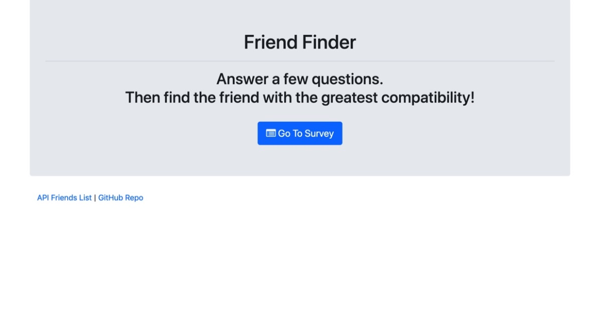
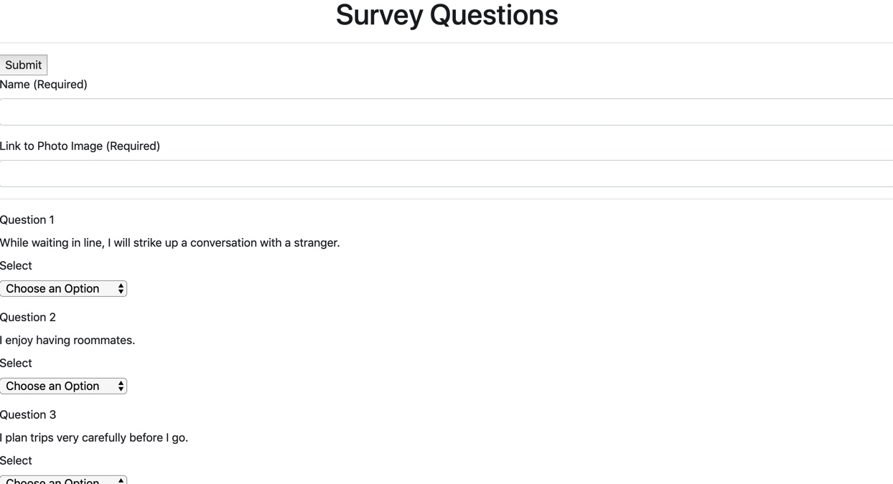
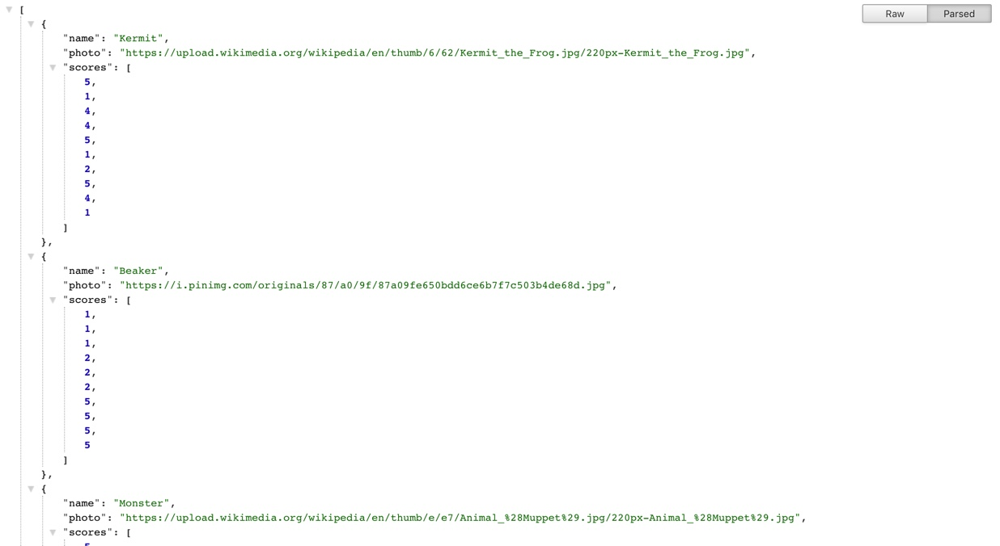

# Friend-Finder
This full-stack site was created during the 13th week of Vanderbilt's Coding Bootcamp. 

This compatability-based web app provides the user with a survey and finds the closest friend match based on their answers. 

## Screen Shot 
Home Page 

Survey Page

Friends Array 

## Technologies Used
- Javascript
- Bootstrap
- Node.js
- Express and Path packages
- Heroku

## Purpose
To complete a full-stack site that takes in a user's information and compares their answers with the answers of other users.

### Additional Goals
- Complete database connection
- Create comparison code 
- Create modal that displays results for user 
- Style each page

